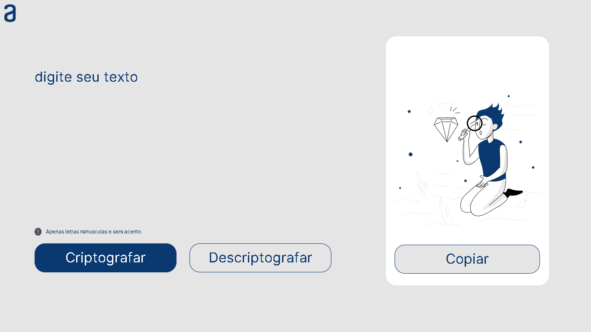

# Olá, Bem vindo ao meu repositório.

Esse projeto foi criado a partir do *Desafio da Alura da Formação Iniciante em Programação T6 - ONE* como referência as mentorias apresentadas durante o curso.

Para quem está começando no mundo da programação foi um desafio fascinante, principalmente pelo fato de que muitas coisas que gostaria de ter feito, não consegui fazer. Não 
posso esquecer de mencionar quantos testes de funcionalidades tentadas e fracassadas, bem como reescrever o codigo para ficar parecido com o que os mentores ensinaram. Mas com
certeza foi uma experiência ótima.

Print da pagina:

## Ferramentas utilizadas:

* HTML

* CSS

* JAVASCRIPT

* VSCODE

## Aluno:

### Mauricio Alejandro. 

link para a pagina (https://flauper2021.github.io/desafioCriptografico/)
